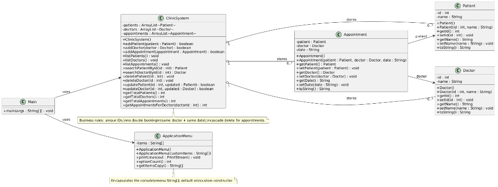

# Clinic Appointment System

Console Java application for **coursework**: register **patients** and **doctors**, **book appointments** with duplicate-slot prevention, and **report** how many appointments a doctor has.

---

## Team

Coursework is split into **four tasks** (one primary owner each):

| Task | Assignee *(fill in Task 2 name when finalized)* | Deliverables |
|------|--------------------------------------------------|--------------|
| **Task 1 — Appointments** | Samar Jnene | `Appointment.java` — links `Patient` + `Doctor`; creation via menu; **double-booking guard** (same doctor + same date); **list all** appointments. Cooperates with `ClinicSystem.addAppointment` / `hasDoctorBookingOnDate` and `Main` (menu cases 3, 6). |
| **Task 2 — Data classes** | Don't know his name | `Patient.java`, `Doctor.java` — **private** fields; **overloaded** constructors; getters/setters **with validation**; **`toString()`**. |
| **Task 3 — Core system / registry** | Abdullah | `ClinicSystem.java` — `ArrayList` storage for patients, doctors, appointments; unique IDs; cascade deletes; search/update/delete/list; **no double booking** enforcement; per-doctor appointment counts. |
| **Task 4 — Application shell & robustness** | Ibrahim | `Main.java` + `ApplicationMenu.java` — console flow, `Scanner` input, **`try/catch`** for invalid numeric input; menu lines live in **`ApplicationMenu`** (private `String[]`); delegates all rules to `ClinicSystem`. |

If your brief requires **student IDs** or a fixed group line on the cover sheet, add them to this table or under **Submission**.

---

## How to run

Requirements: **JDK 17+** (JDK 21+ is fine). No Maven/Gradle.

From the project root:

```bash
javac *.java
java Main
```

Clean compiled classes:

```bash
rm -f *.class
```

---

## Implemented features

1. **Patients** — add, list, search by ID, update (ID/name), delete (removes linked appointments).
2. **Doctors** — add, list, search by ID, update, delete (removes linked appointments).
3. **Appointments** — add (patient ID + doctor ID + date string), list; rejects invalid IDs, empty date, and **double booking** (same doctor + same normalized date).
4. **Totals** — counts for patients, doctors, appointments.
5. **Per-doctor summary** — count appointments for a given doctor ID (`Doctor Appointment Count` menu option).

---

## Where `ArrayList` is used

All persistent domain collections are **`java.util.ArrayList`** inside **`ClinicSystem`**:

| List field | Element type | Role |
|------------|--------------|------|
| `patients` | `Patient` | All registered patients |
| `doctors` | `Doctor` | All registered doctors |
| `appointments` | `Appointment` | All bookings |

**Operations on these lists** include: add (`add`), remove (`remove`, `removeIf`), indexed update (`set`), linear **search** by ID, iteration for listing, and **aggregation** (count appointments per doctor via `getAppointmentsForDoctor`).

---

## Where the array is used

**`ApplicationMenu.java`** holds a private **`String[]`** of option lines (default constructor builds the 14 clinic actions). **`Main`** creates `new ApplicationMenu()` and calls `printLines(System.out)` each loop — a fixed list of choices (not a trivial single-element array). The class also provides an **overloaded constructor** that accepts a custom `String[]` (validated, copied defensively).

---

## UML class diagram

The class diagram for submission is [`docs/uml-class-diagram.png`](docs/uml-class-diagram.png) (includes **`ApplicationMenu`**).



Include **`docs/uml-class-diagram.png`** in your submission ZIP with the source code, per coursework instructions.

---

## Project layout

```
oop-project/
├── Main.java
├── ClinicSystem.java
├── ApplicationMenu.java
├── Patient.java
├── Doctor.java
├── Appointment.java
├── README.md
├── docs/
│   └── uml-class-diagram.png
└── .gitignore
```

---

## Design summary

- **`Main`** — console UI only: `Scanner`, menu loop, `try/catch` for invalid numeric input; delegates to **`ClinicSystem`**; uses **`ApplicationMenu`** for option text.
- **`ApplicationMenu`** — encapsulates the menu **`String[]`**; default and overloaded constructors; prints lines via `printLines`.
- **`ClinicSystem`** — owns three `ArrayList`s; enforces unique IDs, booking rules, and cascade removal of appointments when a patient or doctor is deleted.
- **`Patient` / `Doctor` / `Appointment`** — private fields, validation in setters, overloaded constructors (no-arg + parameterized).

**Class count (excluding `Main`):** `ClinicSystem`, `ApplicationMenu`, `Patient`, `Doctor`, `Appointment` — **five** classes.

---

## Public API (`ClinicSystem`)

**Mutators:** `addPatient`, `addDoctor`, `addAppointment`, `updatePatient`, `updateDoctor`, `deletePatient`, `deleteDoctor`

**Queries:** `searchPatientById`, `searchDoctorById`, `getTotalPatients`, `getTotalDoctors`, `getTotalAppointments`, `getAppointmentsForDoctor`

**Listing:** `listPatients`, `listDoctors`, `listAppointments` (each prints one line per record via `toString()`)

---

## File I / O

Not implemented — no assignment bonus for persistence in this version.

---

## Contributing

1. Run `javac *.java` before pushing.
2. Do not commit `*.class` files (ignored via `.gitignore`).

---

## License

Educational / coursework use unless otherwise specified by your institution.
